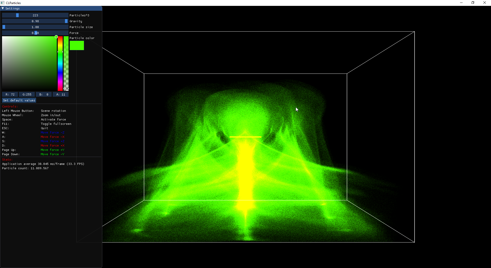

# CLParticles

Calculating particles with OpenCL 1.2 and rendering with OpenGL 4.6

Screenshot:


Video:
<https://www.youtube.com/watch?v=VTs5xOGDT5w>

## Dependencies

- gl3w <https://github.com/skaslev/gl3w>
- glfw <http://www.glfw.org/>
- glm <https://glm.g-truc.net>
- imgui <https://github.com/ocornut/imgui>
- OpenCL SDK for your hardware:
  - For AMD GPUs and CPUs download the [OCL_SDK_Light](https://github.com/GPUOpen-LibrariesAndSDKs/OCL-SDK/releases)
  - For NVIDIA GPUs download the [CUDA Toolkit](http://developer.nvidia.com/object/cuda_download.html)
  - For Intel CPUs/GPUs download the [Intel OpenCL SDK](https://software.intel.com/en-us/intel-opencl)

## Building

### Prerequisites

- Visual Studio 2017
- Python
- CMake

### Build gl3w

```sh
cd gl3w
python gl3w_gen.py
```

### Build glfw

```sh
cd glfw
mkdir build
cd build
cmake -G "Visual Studio 15 2017 Win64" -DBUILD_SHARED_LIBS=ON -DUSE_MSVC_RUNTIME_LIBRARY_DLL=ON -DGLFW_BUILD_TESTS=OFF -DGLFW_BUILD_EXAMPLES=OFF ..
```

Open 'GLFW.sln' in the bild directory and build Debug and Release configuration
